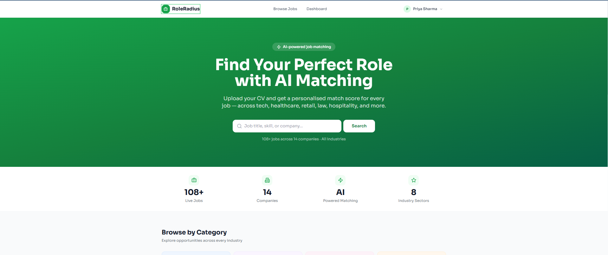
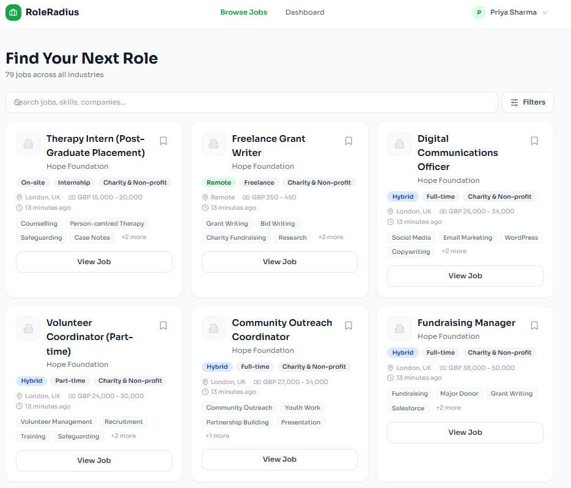
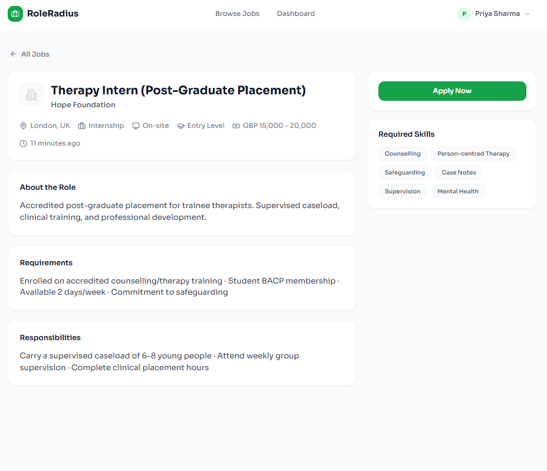
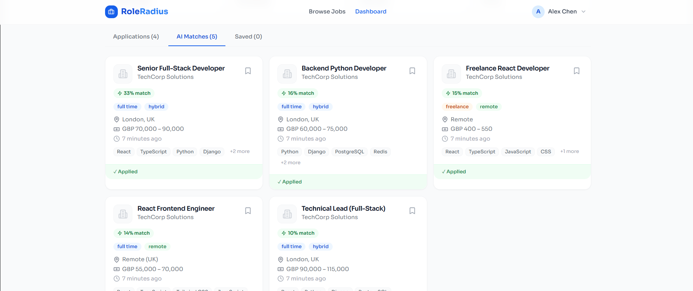
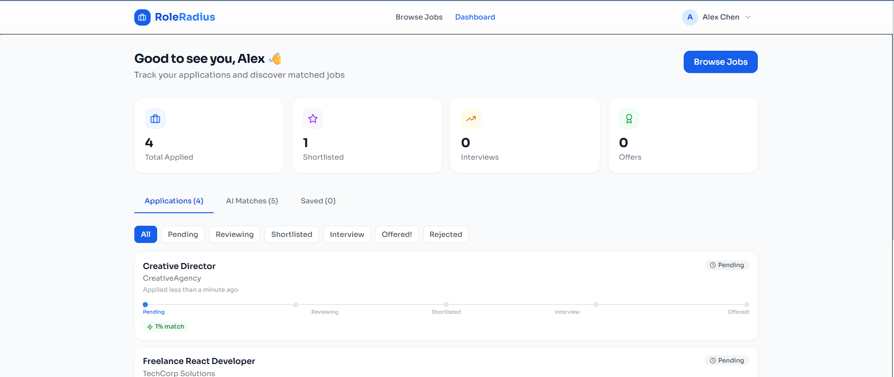
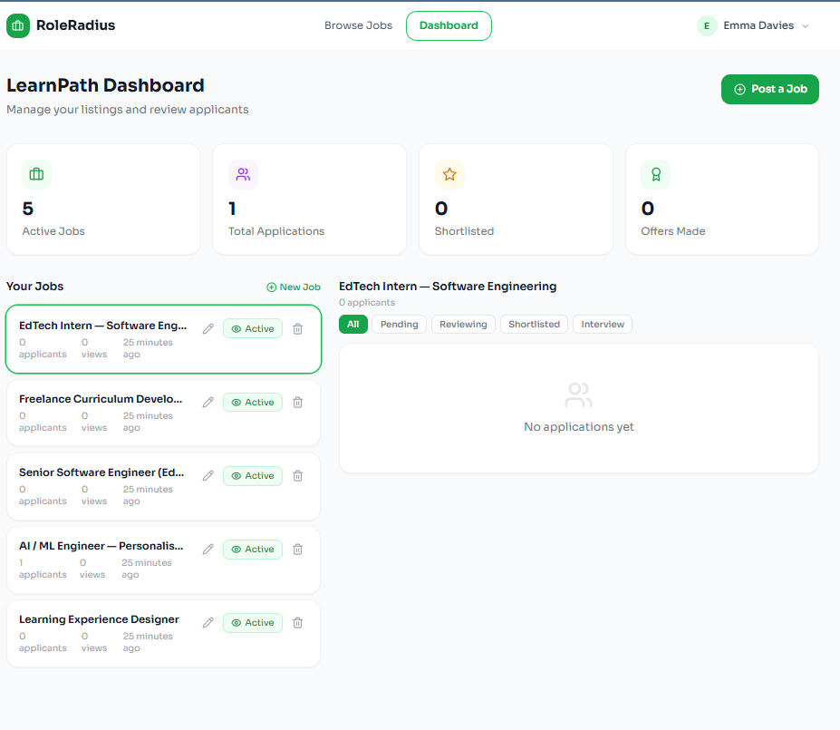
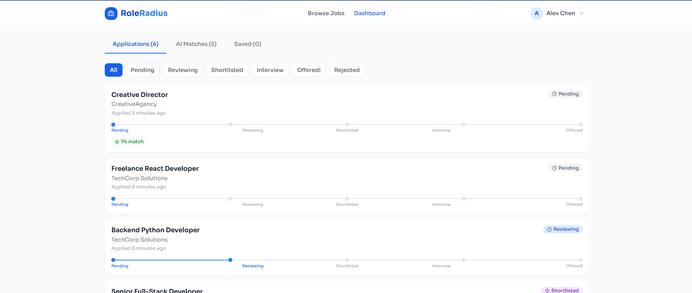
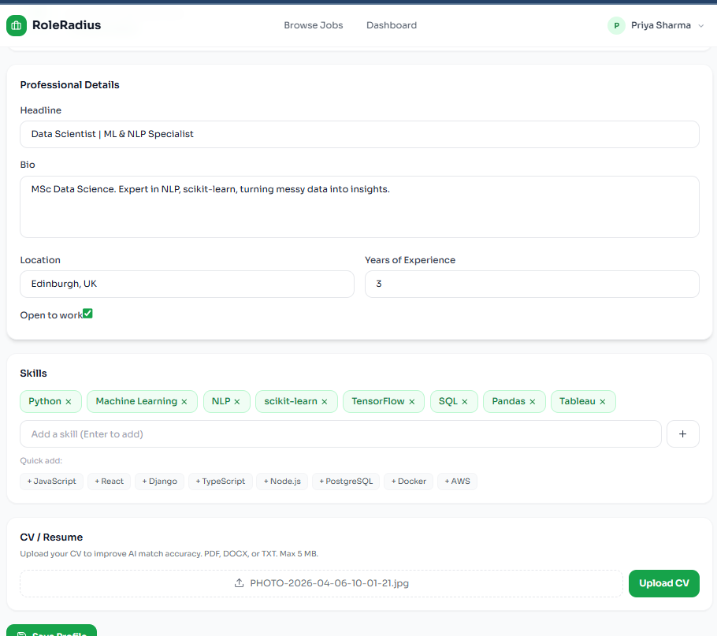

<div align="center">

# 🎯 RoleRadius

**An AI-powered job portal that matches candidates to vacancies using hybrid TF-IDF cosine similarity — built as a final-year Computer Science dissertation project.**

[](https://github.com/ahmedabbas52233-a11y/RoleRadius-Job-Portal/actions/workflows/ci.yml)
[](LICENSE)
[](backend/requirements.txt)
[](backend/requirements.txt)
[](frontend/package.json)

[Live Demo](#-getting-started) · [Features](#-features) · [Matching Engine](#-how-the-matching-engine-works) · [Setup](#-getting-started) · [API Docs](#-api-documentation)

</div>

---

## 📖 About

RoleRadius is a full-stack recruitment platform with two sides: a **candidate
experience** (browse jobs, apply, track applications, get AI-ranked job
matches) and a **recruiter experience** (post jobs, manage an applicant
pipeline, source candidates directly). The core of the project — and its
academic contribution — is the matching engine, which combines classic
information-retrieval techniques with structured candidate/job compatibility
signals to produce ranked, *explainable* matches rather than an opaque score.

It's built with production-shaped concerns in mind, not just a tutorial demo:
JWT authentication via httpOnly cookies, role-based authorization, rate
limiting and account lockout, a CI pipeline that runs the full test suite and
a security scan on every push, and a documented, signal-driven caching layer
for the matching corpus.

## 📸 Screenshots

| | |
|---|---|
| **Home** | **Job Listings** |
|  |  |
| **Job Detail** | **AI-Matched Jobs** |
|  |  |
| **Candidate Dashboard** | **Recruiter Dashboard** |
|  |  |
| **Applications Tracking** | **Profile / CV** |
|  |  |

## ✨ Features

**For candidates**
- Browse and filter jobs by location, salary, work mode, experience level, and job type
- AI-ranked **"Matches for you"** with a transparent breakdown — which required skills matched, which are missing, and whether location, experience level, and salary actually line up
- Apply with a cover letter and CV upload (PDF/DOCX text extraction for matching)
- Track every application's status through a full pipeline — *Pending → Reviewing → Shortlisted → Interview → Offered → Hired* (or Rejected / Offer Declined / Withdrawn) — with a visible history timeline
- Save jobs, manage your profile, and delete your account and all associated data on request

**For recruiters**
- Post, edit, pause, and delete job listings
- Review applicants with full profile access, CV download, private notes, and a structured rejection-reason / interview-scheduling flow
- Move applicants through the pipeline individually or in bulk
- **Source candidates directly** — search the pool of candidates who've opted in to being discovered, not just inbound applicants
- Dashboard stats: active jobs, total applications, pipeline breakdown

**Platform**
- Role-based access control (candidate / recruiter), enforced server-side on every endpoint
- JWT auth delivered via httpOnly, `SameSite=Lax` cookies (not readable by JS, mitigating XSS token theft)
- Rate limiting and brute-force lockout (`django-axes`) on auth endpoints
- Cached matching corpus with signal-driven invalidation (no stale scores after a profile or job edit)
- 113 automated backend tests + ESLint-clean, production-building frontend, enforced in CI

## 🧠 How the Matching Engine Works

Most "AI matching" job boards stop at keyword overlap. RoleRadius's engine
(`backend/matching/engine.py`) combines two layers:

1. **Text similarity** — a TF-IDF vectorizer fit over job descriptions and
   candidate profiles/CVs, scored by cosine similarity. This is the
   classic information-retrieval half: it rewards distinctive shared
   vocabulary ("Kubernetes", "PostgreSQL") and downweights common words.
2. **Structured compatibility signals** — computed directly from fields a
   pure-text approach ignores entirely:
   - Exact skills-list overlap (which required skills are actually matched vs. missing)
   - Location / work-mode compatibility (remote jobs are always compatible)
   - Experience-level fit (years-of-experience banded against the job's stated level)
   - Salary range overlap

The two layers combine into a single 0–100 score:

| Component | Weight |
|---|---|
| Text similarity | 45% |
| Skills overlap | 25% |
| Location compatibility | 15% |
| Experience-level fit | 10% |
| Salary overlap | 5% |

Every match returns *why* it scored the way it did (`matched_skills`,
`missing_skills`, `location_compatible`, `experience_fit`,
`salary_compatible`) — surfaced directly in the UI — rather than a bare,
unexplained percentage. The TF-IDF corpus is cached and invalidated via
Django signals whenever a job or profile changes, so the expensive vectorizer
fit isn't repeated on every request while still never serving a stale corpus.

## 🛠️ Tech Stack

| | |
|---|---|
| **Backend** | Django 4.2 · Django REST Framework · `djangorestframework-simplejwt` · PostgreSQL · scikit-learn (TF-IDF) · `django-axes` · `django-csp` · Gunicorn · WhiteNoise |
| **Frontend** | React 18 · Vite · React Router · Tailwind CSS · Axios · `react-hot-toast` · `lucide-react` |
| **Infra** | Docker / Docker Compose · GitHub Actions CI · Railway-ready (`railway.json`) · Cloudinary (optional media storage) · Redis (optional cache backend) |
| **Testing** | Django `TestCase` + DRF `APIClient` (113 tests) · ESLint |

## 🏗️ Architecture

```
┌──────────────┐   HTTPS / JSON over   ┌────────────────────┐   Django ORM   ┌────────────┐
│  React (Vite)│ ────────────────────▶ │  Django REST API   │ ─────────────▶ │ PostgreSQL │
│     SPA      │ ◀──────────────────── │     (Gunicorn)      │ ◀───────────── │            │
└──────────────┘  JWT in httpOnly      └────────────────────┘                └────────────┘
                      cookies                    │
                                                  ▼
                                          ┌────────────────┐
                                          │  Django cache  │  (LocMemCache, or
                                          │ (TF-IDF corpus)│   Redis if configured)
                                          └────────────────┘
```

The backend is split into four focused Django apps:

| App | Responsibility |
|---|---|
| `accounts` | Users, candidate/recruiter profiles, auth, talent search |
| `jobs` | Job postings, filtering, saved jobs |
| `applications` | The application pipeline, status transitions, bulk actions |
| `matching` | The scoring engine — no models of its own, just logic other apps call into |

## 🚀 Getting Started

### Option A — Docker Compose (recommended)

```bash
git clone https://github.com/ahmedabbas52233-a11y/RoleRadius-Job-Portal.git
cd RoleRadius-Job-Portal
docker compose up --build
```

The API will be available at `http://localhost:8000` and the frontend at
`http://localhost:5173` (or `http://localhost` for the production compose
profile, served via Nginx).

### Option B — Manual setup

**Backend**

```bash
cd backend
python -m venv venv
source venv/bin/activate          # Windows: venv\Scripts\activate
pip install -r requirements.txt
cp .env.example .env               # fill in your own SECRET_KEY and DB credentials
python manage.py migrate
python manage.py seed_jobs         # optional — seeds demo jobs and accounts
python manage.py runserver
```

**Frontend**

```bash
cd frontend
npm install
cp .env.example .env
npm run dev
```

### Demo accounts

After running `seed_jobs`, every seeded account uses the password `demo1234`. For
example:

| Email | Role |
|---|---|
| `priya.sharma@email.com` | Candidate (Data Scientist — strong AI match demo) |

See `backend/jobs/management/commands/seed_jobs.py` for the full list.

## 🧪 Running Tests

```bash
# Backend
cd backend
python manage.py test

# Frontend
cd frontend
npm run lint
npm run build
```

CI (`.github/workflows/ci.yml`) runs the Django test suite, a
`makemigrations --check` drift guard, a security scan (`pip-audit` /
`bandit`), ESLint, and a production build on every push — see badge above.

## 📚 API Documentation

Interactive API docs are auto-generated via `drf-spectacular` once the
backend is running:

- Swagger UI: `http://localhost:8000/api/schema/swagger-ui/`
- ReDoc: `http://localhost:8000/api/schema/redoc/`
- Raw OpenAPI schema: `http://localhost:8000/api/schema/`

## 📁 Project Structure

```
RoleRadius-Job-Portal/
├── backend/
│   ├── accounts/        # users, profiles, auth, talent search
│   ├── applications/    # application pipeline
│   ├── jobs/             # job postings
│   ├── matching/         # TF-IDF + structured-signal scoring engine
│   └── roleradius/       # Django project settings/urls
├── frontend/
│   └── src/
│       ├── components/   # shared UI (JobCard, MatchBreakdown, etc.)
│       ├── contexts/     # AuthContext
│       ├── pages/        # route-level views
│       └── services/     # API client
├── docs/screenshots/      # README screenshots
└── docker-compose.yml
```

## 🔒 Security

See [SECURITY.md](SECURITY.md) for the project's security policy and how to
report a vulnerability. Notable design choices: JWT delivered via httpOnly
cookies (not `localStorage`, to limit XSS blast radius), `SameSite=Lax`
cookie scoping, server-side role checks on every endpoint (not just
client-side route guards), and rate-limited/lockout-protected auth endpoints.

## 🤝 Contributing

Contributions are welcome — see [CONTRIBUTING.md](CONTRIBUTING.md) for the
workflow, coding conventions, and how to run the test suite before opening a PR.

## 📄 Citing This Project

If you reference RoleRadius in academic work, please cite it using the
metadata in [`CITATION.cff`](CITATION.cff) (GitHub also exposes a "Cite this
repository" button in the sidebar generated from that file).

## 📜 License

Distributed under the MIT License. See [LICENSE](LICENSE) for details.

---

<div align="center">

Built by **Ahmad Abbas Hussain** as a final-year Computer Science dissertation project.

</div>